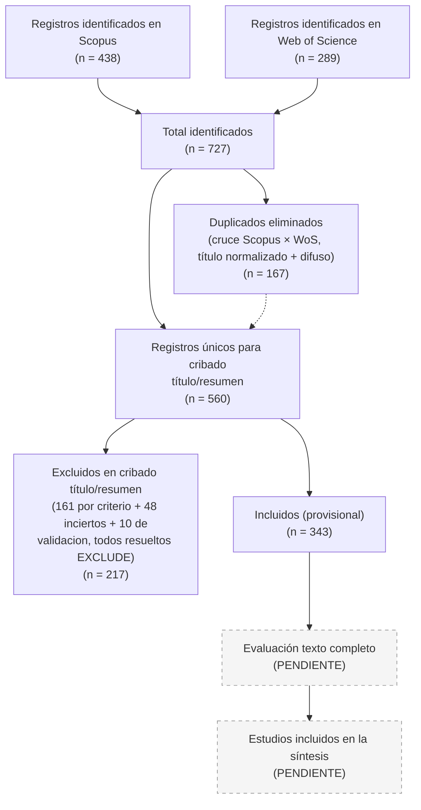

# Diagrama de flujo PRISMA 2020 — estado actual

Cubre desde identificación hasta cribado título/resumen (asistido por IA,
con los casos inciertos y los desacuerdos de la validación por muestreo ya
resueltos por el autor de la tesis). La evaluación a texto completo y la
síntesis final **están pendientes** — ver limitaciones en
`07-cribado/metodologia.md` y `07-cribado/validacion.md` sobre la
naturaleza preliminar del cribado (validado por segunda pasada IA-IA, aún
sin doble revisión humana independiente).

Versión renderizada lista para incrustar en el capítulo metodológico (Word,
LaTeX, PowerPoint): [`prisma_diagrama.png`](prisma_diagrama.png) (raster,
alta resolución) o [`prisma_diagrama.svg`](prisma_diagrama.svg) (vectorial).
Ambas se generan desde el mismo código Mermaid de abajo con
`mmdc -i prisma_diagrama.mmd -o prisma_diagrama.png`.

## Tabla de conteos

| Fase | n | Fuente / script |
|---|---|---|
| Identificados — Scopus | 438 | `02-exports-crudos/scopus_438_extraido.csv` |
| Identificados — WoS | 289 | `02-exports-crudos/wos_289_savedrecs.bib` |
| Total identificados | 727 | suma directa |
| Duplicados eliminados | 167 | `scripts/dedup.py` → `03-deduplicacion/metodologia.md` |
| **Únicos para cribado** | **560** | `PRISMA_master_final.csv` |
| Excluidos en cribado título/resumen por criterio (IA, primera pasada) | 161 (28.8%) | `07-cribado/resultados-cribado.csv` |
| Inciertos (IA), resueltos EXCLUDE por el autor | 48 (8.6%) | `07-cribado/resultados-cribado.csv` (columna `resolucion`) |
| Desacuerdos IA-IA en validación por muestreo, resueltos EXCLUDE | 10 (de una muestra de 102) | `07-cribado/validacion.md` |
| **Excluidos, total (decisión final)** | **217 (38.8%)** | `cribado_decision_final` en `PRISMA_master_final.csv` |
| **Incluidos (decisión final, provisional)** | **343 (61.3%)** | `cribado_decision_final` en `PRISMA_master_final.csv` |
| Evaluados a texto completo | — | pendiente |
| Incluidos en síntesis final | — | pendiente |

**Sobre la resolución de los 48 inciertos:** el cribado asistido por IA no
decidió esos 48 casos por ambigüedad genuina (población institucional vs.
individual, activo físico vs. financiero, constructo conductual mencionado
solo tangencialmente, etc. — ver `07-cribado/metodologia.md`). El autor de
la tesis revisó los motivos documentados para cada uno y decidió **excluir
los 48 por precaución**: ante la duda sobre si un registro cumple los
criterios de población, constructo o alcance de activos definidos para la
taxonomía de la tesis, se prefiere un corpus más estricto y defendible
sobre uno más amplio pero con ajuste dudoso.

**Sobre la validación por muestreo:** se ejecutó una segunda pasada de
cribado, ciega e independiente, sobre una muestra estratificada del 20%
(102/512) de los registros que la IA sí había decidido. El acuerdo fue
90.2% (Kappa de Cohen = 0.799, "sustancial" según Landis & Koch). Los 10
desacuerdos se resolvieron con la misma regla de precaución (excluir ante
duda) — ver el detalle completo, la tabla de contingencia y la lista de
los 10 casos en `07-cribado/validacion.md`.

Ninguna de estas resoluciones sobrescribe la clasificación original de la
IA: la columna `cribado_decision_ia` en el CSV maestro conserva siempre la
propuesta original (`INCLUDE`/`EXCLUDE`/`UNCERTAIN`), y `cribado_resolucion`
documenta el motivo de cada ajuste — por si en una fase posterior conviene
reconsiderar alguno de estos 58 registros (48 + 10) que requirieron
resolución.

**Importante:** el conteo de incluidos (343) sigue siendo **preliminar**:
la validación hecha (Kappa 0.799) mide consistencia IA-IA, no reemplaza
una revisión humana independiente como exige el estándar PRISMA. Se
recomienda que el autor de la tesis revise al menos una submuestra humana
antes de citar este número en el capítulo metodológico — ver
`07-cribado/metodologia.md` y `07-cribado/validacion.md`.

Todo número de identificación/deduplicación es recalculable ejecutando
`scripts/dedup.py` sobre los archivos de `02-exports-crudos/`. Los conteos
de cribado no son recalculables por script (requieren juicio de contenido
por registro); `07-cribado/resultados-cribado.csv` es la evidencia
congelada del cribado del 2026-08-12, con la resolución de inciertos y de
la validación por muestreo del autor del 2026-08-16.
